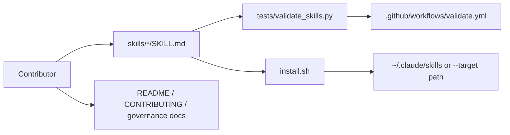

# Skillsmith Project Map

## Purpose and scope

This map describes the current Skillsmith repository as observed from the files in the working tree. It covers repository layout, ownership boundaries, validation, installation, CI, and lifecycle documentation.

It does not define a future architecture, backlog, release plan, or new skill behavior. Future changes should use `docs/workflows.md` for routing and `CONSTITUTION.md` for governance.

## System overview

Skillsmith is a reusable prompt-skill library. The main product artifacts are Markdown prompt files under `skills/<skill-name>/SKILL.md`.

Observed major parts:

- Skill catalog: `skills/*/SKILL.md` contains 10 prompt skills.
- Validator: `tests/validate_skills.py` checks skill structure.
- Installer: `install.sh` clones the repository and copies skill directories into a target skills directory.
- GitHub automation: `.github/workflows/validate.yml` runs the validator on push and pull request to `main`.
- User documentation: `README.md`, `CONTRIBUTING.md`, issue templates, and PR template.
- Governance and workflow documentation: `CONSTITUTION.md`, `VISION.md`, `AGENTS.md`, `CLAUDE.md`, `docs/workflows.md`, and `docs/vision/strategic-positioning.md`.

## Repository layout

`skills/`
: Owns reusable prompt skills. Each skill is a directory containing one `SKILL.md` file with YAML frontmatter and a Markdown prompt body.

`tests/validate_skills.py`
: Owns local and CI validation. It parses skill frontmatter, checks required fields, checks `$ARGUMENTS`, checks `## Output Format`, warns on missing best-practice fields, and warns on CJK or Cyrillic in UI metadata.

`install.sh`
: Owns installation behavior. It clones `https://github.com/xiongxianfei/Skillsmith`, copies every directory under `skills/` into `${HOME}/.claude/skills` or a `--target` directory, and replaces existing target skill directories.

`.github/workflows/validate.yml`
: Owns CI validation. It installs `pyyaml` on Python 3.12 and runs `python tests/validate_skills.py` on push and pull request to `main`.

`.github/pull_request_template.md`
: Owns reviewer-facing checklist items for new skills, bug fixes, improvements, and validation evidence.

`.github/ISSUE_TEMPLATE/`
: Owns issue intake for bug reports and skill requests.

`README.md`
: Owns public product introduction, skill table, installation instructions, usage instructions, and selected skill details.

`CONTRIBUTING.md`
: Owns contributor instructions for adding, improving, reporting, and fixing skills.

`AGENTS.md` and `CLAUDE.md`
: Own concise agent-facing operating rules for Codex-style and Claude-style agents.

`CONSTITUTION.md`
: Owns durable governance, source-of-truth order, workflow expectations, validation rules, review rules, and agent behavior rules.

`VISION.md`
: Owns project identity, target audience, commitments, refusals, falsifiability, and open vision-level questions.

`docs/workflows.md`
: Owns local RigorLoop artifact locations and stage-routing guidance.

`docs/vision/strategic-positioning.md`
: Records the rationale behind the current vision positioning.

## Runtime flow

There is no application server, API process, database-backed runtime, or background worker in the repository today.

Observed runtime-like flows:

1. User invokes a skill in an AI assistant.
2. The assistant reads the installed `SKILL.md`.
3. Slash-command input flows through `$ARGUMENTS`.
4. The prompt body instructs the assistant how to reason and format output.

Installer flow:

1. User runs `install.sh` directly or through the README curl command.
2. Script creates a temporary directory.
3. Script clones the Skillsmith GitHub repository into the temporary directory.
4. Script copies each `skills/*/` directory into the target skills directory.
5. Script deletes the temporary clone on exit.

Validation flow:

1. Local user or CI runs `python tests/validate_skills.py`.
2. Validator iterates through directories under `skills/`.
3. Validator parses each `SKILL.md` frontmatter and body.
4. Validator records errors and warnings.
5. Validator exits non-zero when errors exist and exits zero when only warnings exist.

## Data flow

Primary data entities are filesystem artifacts:

- Skill definitions: `skills/<skill-name>/SKILL.md`.
- Skill metadata: YAML frontmatter fields such as `name`, `description`, and `argument-hint`.
- Skill prompt body: Markdown instructions that include `$ARGUMENTS` and `## Output Format`.
- Workflow and governance data: Markdown files in the repository root and `docs/`.

Serialization boundaries:

- YAML frontmatter is parsed by `yaml.safe_load` in `tests/validate_skills.py`.
- All skill bodies and docs are plain Markdown text.
- Installer copies directories directly; it does not transform skill content.

## External boundaries

Observed external dependencies:

- GitHub repository URL in `install.sh` and README examples.
- `git` command required by `install.sh`.
- Bash shell required by `install.sh`.
- Python required by `tests/validate_skills.py`.
- `pyyaml` required by `tests/validate_skills.py` and installed in CI.
- GitHub Actions used for CI.
- Claude Code skills and Codex slash-command compatibility are documented compatibility surfaces.

There are no observed runtime calls from skills to external APIs. Skills omit runtime-specific tool metadata, so they are intended as pure prompt assets.

## Test map

Current automated test coverage is validator-based:

- `tests/validate_skills.py` validates all skill files.
- `.github/workflows/validate.yml` runs the validator in CI.

There are no separate unit test, integration test, end-to-end test, smoke test, or fixture directories observed.

The validator checks:

- `SKILL.md` exists in each skill directory.
- YAML frontmatter can be parsed.
- Required fields `name`, `description`, and `argument-hint` exist.
- Runtime-specific frontmatter such as `effort` and `allowed-tools` is omitted by default.
- UI metadata avoids CJK and Cyrillic scripts.
- `$ARGUMENTS` appears in the body.
- `## Output Format` appears in the body.

## CI/release map

CI:

- `.github/workflows/validate.yml` runs on push and pull request to `main`.
- CI uses Python 3.12.
- CI installs `pyyaml`.
- CI runs `python tests/validate_skills.py`.

Release and distribution:

- Public installation is documented through `curl -sSL .../install.sh | bash`.
- Manual installation is documented through `git clone` and `cp -r`.
- Project-level installation uses `install.sh --target .claude/skills`.
- Plugin distribution is not part of the current observed repository boundary.

## Architecture rules observed

Observed repository patterns:

- One skill per directory under `skills/`.
- One canonical prompt file per skill: `SKILL.md`.
- Skill metadata stays in YAML frontmatter.
- Skill behavior stays in the Markdown prompt body.
- Skill bodies can be multilingual, while descriptions and argument hints are English.
- Validation is centralized in one Python script.
- CI reuses the same command documented for local validation.
- Installer is intentionally simple and copies files without generating prompt content.
- Governance separates project identity (`VISION.md`), durable rules (`CONSTITUTION.md`), agent guidance (`AGENTS.md`, `CLAUDE.md`), and workflow routing (`docs/workflows.md`).

Inferred from current docs:

- The repo favors portability over vendor-specific runtime logic.
- Prompt changes should remain reviewable as plain text.
- Changes that affect behavior, safety, validation, installation, or compatibility need written requirements before implementation.

## Risk areas

Limited automated test depth:
: The repository has structural validation but no fixture-based tests for validator edge cases or sample skill outputs.

High-stakes skills:
: `doctor` and `oscp-coach` operate in sensitive domains. Their prompts include safety-oriented content, but future changes need careful review against `CONSTITUTION.md`.

README enumeration drift:
: README installation and skill lists enumerate current skills. New skills require synchronized README updates.

Installer destructive replacement:
: `install.sh` removes an existing target skill directory before copying the new one. This is expected behavior today but should be considered when changing installation semantics.

Repository rename surfaces:
: GitHub URLs, install paths, and plugin namespace examples depend on the project name. Future renames need stale-reference searches and installer verification.

## Open questions

Should validator behavior be expanded to enforce lowercase hyphenated names and pushy descriptions as errors rather than warnings or documentation-only rules?

Should high-stakes skills have a dedicated safety checklist or test fixture before changes are accepted?

Should representative prompt-output examples live in each skill directory, in PRs only, or in a separate fixtures directory?
